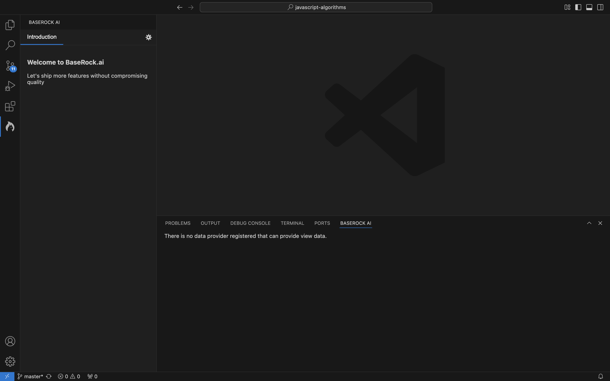
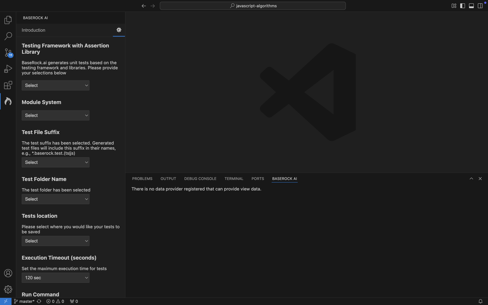
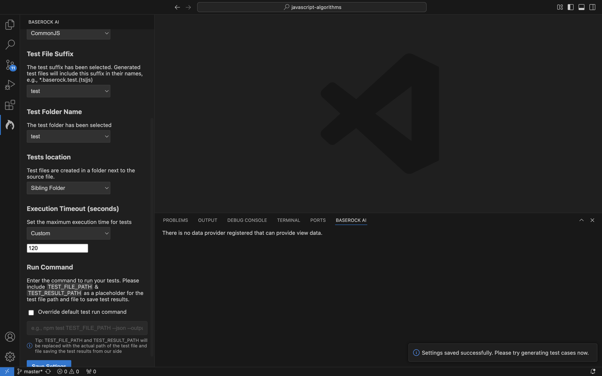

# **BaseRock AI: Setup & Troubleshooting Guide for JavaScript & TypeScript Projects**

## **Prerequisites**

Before using the BaseRock AI VS Code extension, ensure the following requirements are met:

### **1. Testing Framework Configuration**
- Your project must include a **testing framework** (e.g., Jest, Mocha) and an **assertion library** (e.g., Chai, Expect) as **dev dependencies** in `package.json`.
- Example (`package.json`):
  ```json
  "devDependencies": {
    "jest": "^29.0.0",
    "chai": "^4.3.0"
  }
  ```

### **2. Test File Configuration**
- Ensure your test files are located in a directory that matches the test regex pattern set in your configuration files.
- Example regex for Jest:
  ```json
  {
    "testMatch": ["**/__tests__/**/*.[jt]s?(x)"]
  }
  ```
- If test files are not detected, check if they conform to your **configured pattern**. You can also update the location of your test file in BaseRock Settings

### **3. Framework-Specific Requirements**
Depending on your project type, install the required testing utilities:
- **React**: Ensure `@testing-library/react` is installed.
  ```json
  "devDependencies": {
    "@testing-library/react": "^13.4.0"
  }
  ```
- **Angular**: Ensure `@angular/core/testing` is listed in your dependencies.
  ```json
  "devDependencies": {
    "@angular/core": "^15.0.0"
  }
  ```

### **4. Install Dependencies**
- Run the appropriate package manager command based on your project setup:
  ```sh
  # Using npm
  npm install  

  # Using yarn
  yarn install
  ```

## **Troubleshooting**

### **Unable to Sign In?**

If you are experiencing issues signing in, follow these steps:

1. When the **Sign In** prompt appears at the bottom right of VS Code, click **Proceed**.
2. This will open your default browser, where you can select a preferred sign-in method.
3. For the best experience, use **Google Chrome** or **Mozilla Firefox**.
- If a different browser opens automatically, **copy the URL** and paste it into Chrome or Firefox to proceed.

### **Test Generation Issues**
**1. Verify Testing Framework Installation**
- Run:
  ```sh
  npx jest --version  # For Jest  
  npx mocha --version # For Mocha  
  ```
- If not found, install one.

**2. Verify test file location**
- Ensure test files are in a recognized test folder.
- Check your test file regex configuration.

**3. Ensure VS Code has access to the workspace**
- If you see permission errors, restart VS Code and check workspace settings.

### **Tests Execution Issues**
**1. Confirm that the test runner is working**
- Try running tests manually:
  ```sh
  npm test path/to/testfile.js
  ```
- If tests fail, check for missing dependencies.

**2. Check `testCommand` configuration**
- Ensure that the test command mentioned in Output > BaseRock AI is correct. If not, update it in BaseRock settings.

### **BaseRock Settings**

- Ensure BaseRock settings has the correct configurations required to generate & execute the tests.
- BaseRock settings can be accessed by clicking on the baserock logo on the sidebar (left-most panel) and the clicking on settings icon on the top right.
- Following images can be used as a guide to save baserock settings.
- 
- 
- 

### **CodeLens Implementation**
**1. Ensure file type is supported**
- CodeLens appears only for **JavaScript/TypeScript test files** (`.js`, `.ts`, `.jsx`, `.tsx`, `.vue`).

**2. Check VS Code settings**
- Ensure `editor.codeLens` is enabled in your settings (`Ctrl + ,` → Search `CodeLens`).

### **BaseRock with Cursor IDE**
BaseRock plugin can be installed with cursor IDE. The minimum version for the support is `0.45.14`.

---

### **Support**
For additional assistance, please contact our support team:
- Email: support@baserock.ai


