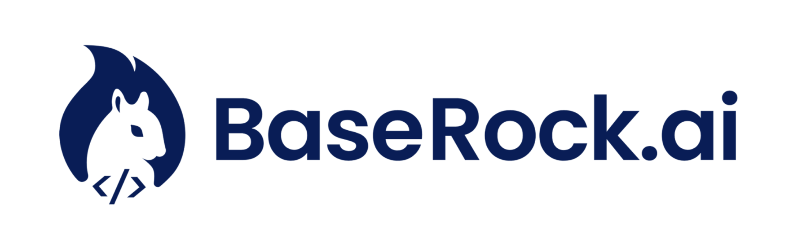

# User Guide

**Version 1.2**

## Table of Contents

- [About BaseRock Agentic QA Platform](#about-baserock-agentic-qa-platform)
  - [Deployment Architecture](#deployment-architecture)
  - [BaseRock Control Plane](#baserock-control-plane)
  - [BaseRock Agent](#baserock-agent)
- [Getting Started](#getting-started)
  - [Prerequisites](#prerequisites)
  - [First Time Login](#first-time-login)
- [Service Onboarding](#service-onboarding)
  - [Adding Service](#adding-service)
  - [Service Requirement Document](#service-requirement-document)
  - [Test Creation](#test-creation)
  - [Running Tests](#running-tests)
- [Playbooks](#playbooks)
  - [Side Bar Navigation Menu](#side-bar-navigation-menu)
- [BaseRock Agent Usage](#baserock-agent-usage)
- [Appendix](#appendix)

## About BaseRock Agentic QA Platform

BaseRock Agentic QA is an advanced AI-driven smart automation platform purpose-built to automate functional testing through intelligent, self-learning QA agents. It empowers teams to validate software behavior across complex user journeys, APIs, and integrations — without relying heavily on manually written test scripts.

### Deployment Architecture

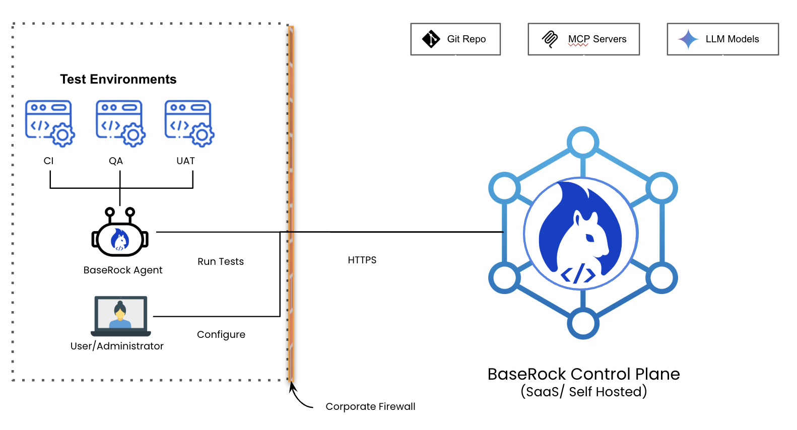

The BaseRock Agentic QA Platform is composed of two primary components — the BaseRock Control Plane and the BaseRock Agent.

### BaseRock Control Plane

The Control Plane serves as the central hub for managing the entire QA process.
It enables users to:

Onboard services and define testing requirements

Strategize test plans and prepare comprehensive test suites

Integrate with external systems such as source code repositories, MCP Servers, and LLM foundation models

The Control Plane is available as both a SaaS offering and a self-hosted deployment.
It includes a web-based UI portal that allows users to easily create connectors, configure environments, and manage automation.

Once the setup is complete, the Control Plane leverages the BaseRock Agent Execution Engine to:

Connect securely to customer environments

Execute test suites against target environments

Orchestrate the entire CI/CD-driven QA workflow

### BaseRock Agent

The BaseRock Agent operates within the customer’s environment — typically behind their firewall — and acts as a secure bridge between the Control Plane and local systems.

The Agent:

Connects to the Control Plane and receives test execution instructions

Has access to customer environments (e.g., CI, QA, UAT)

Executes automated test suites as part of the CI/CD pipeline

It can be deployed on:

A developer’s local machine for on-demand testing

A dedicated worker node (physical or virtual) for continuous integration workflows

In addition, the BaseRock Agent can be used as a CLI tool to perform various operations such as:

Adding or configuring a service

Running test suites

Managing local test assets and credentials

Check BaseRock Usage section for more details.

## Getting Started

### Prerequisites

Access to BaseRock AI: This guide assumes you have access to the BaseRock AI SaaS platform or a Control Plane deployed in your VPC that allows you to configure your application. We’ll use the SaaS based control plane for illustration. If you need access, email sales@baserock.ai.

Your Application: You need to have an environment running your application, so you could allow baserock-agent to target the environment and execute all the functional test cases.

If you do not have a proper application set up, you can use the sample TODO List application  available here: … The respective README file can be found here: that describes how to set up the application locally.

Admin Access to Source Code Repository: BaseRock installs an app via OAuth in your GitHub, BitBucket or GitLab repository that allows BaseRock to access the source code and learn about your application. This requires someone with admin access.

### First Time Login

For a newly created account, you can login using email using the following steps:

Open Control plane URL in your browser (https://app.baserock.ai in case of SaaS)

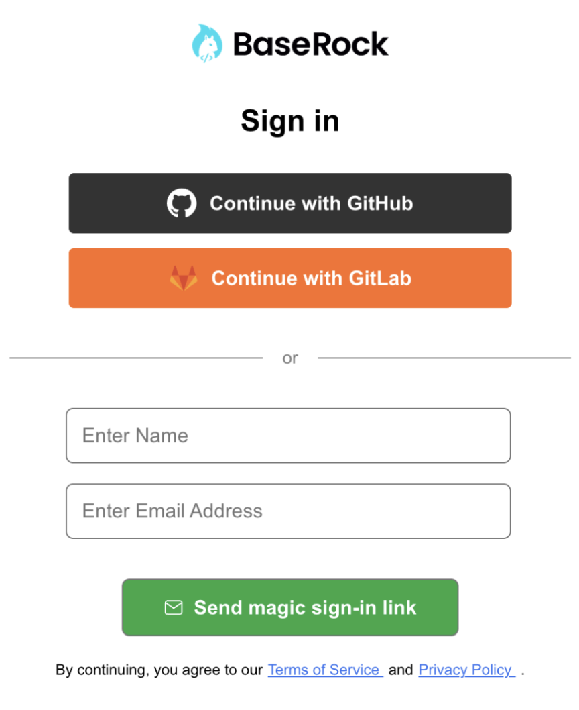

Use any of Github or Gitlab based via OAuth in your browser

Or you can use name and email address to login via email.

Enter your name and email address.

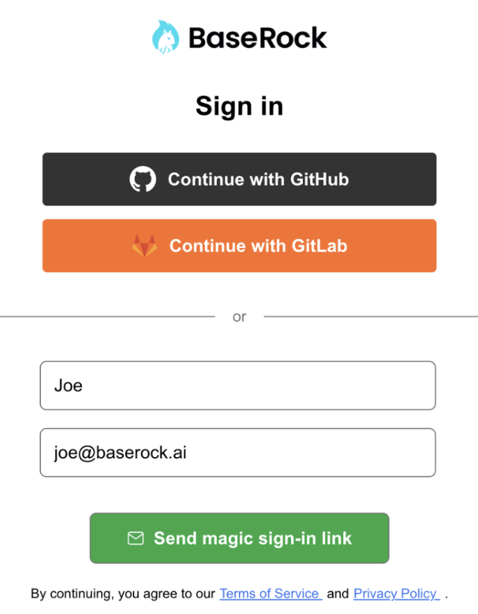

Go to your inbox and find the email sent by BaseRock AI. Attn: Check the spam folder if it does not show up in the inbox.

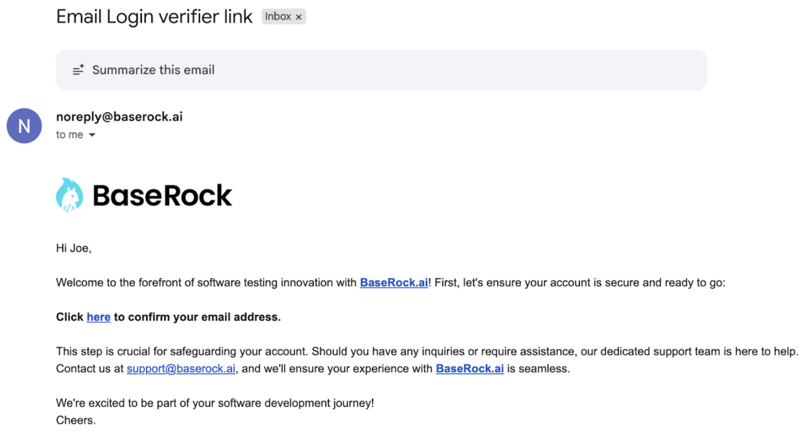

Click on the link under “Click here to confirm your email address”

Go back to the BaseRock AI tab and click on REFRESH button

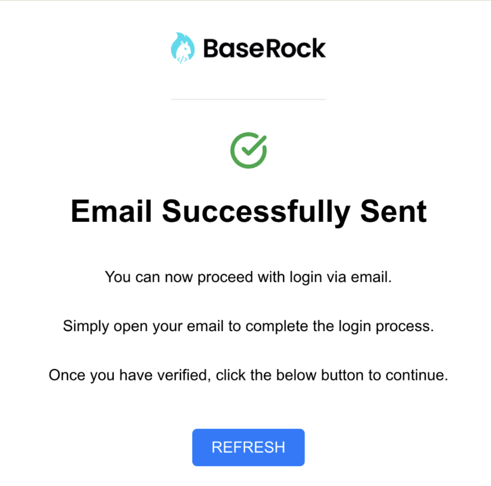

You should be able to get into the BaseRock AI application.

#### Invite Team members

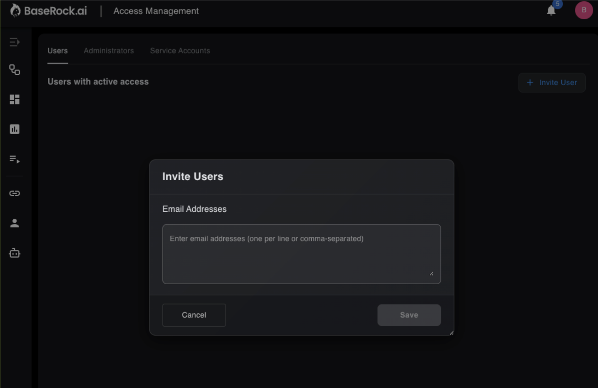

#### Setup LLM Provider

BaseRock operates using the client’s LLM API key and offers broad support for leading providers such as Anthropic, OpenAI, and models available through Azure, Amazon Bedrock, and Google Vertex or directly the API key.

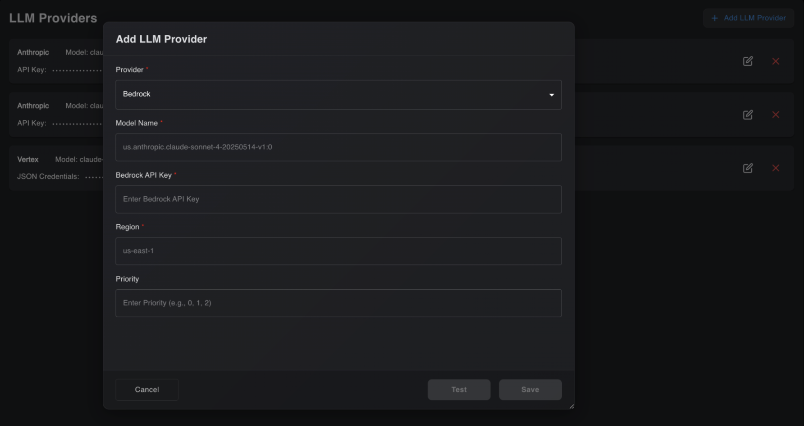

#### Add Connector

BaseRock supports git connectors of Bitbucket (Cloud and Native) and Github (Cloud).

The access is Read-only access for the source code following strict compliance as BaseRock is SOC-Type 2 certified.

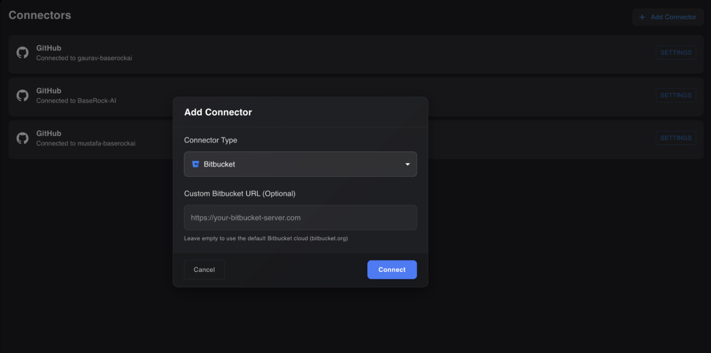

## Service Onboarding

### Adding Service

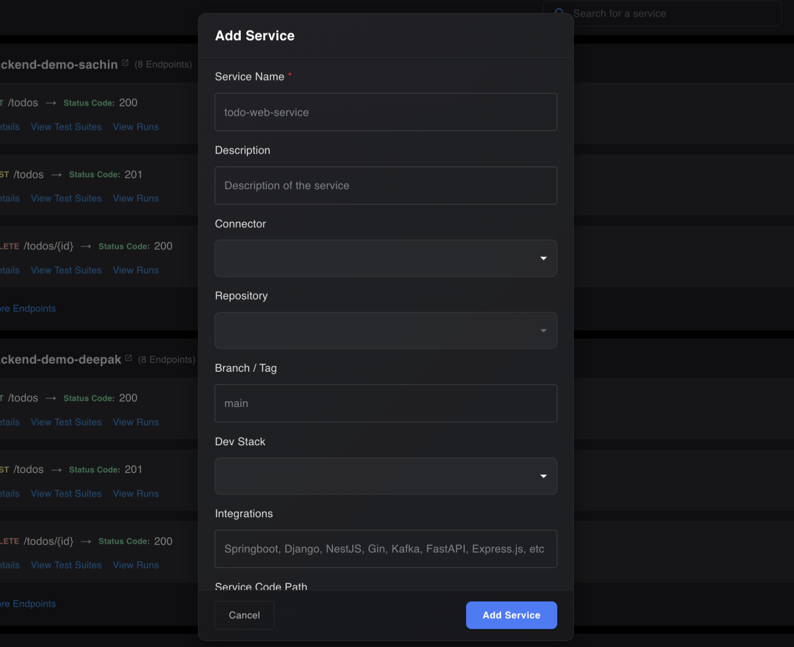

Adding a service in BaseRock allows users to discover all the available endpoints present in their respective micro-service.

Click on the “Add Service” button on the top right corner to open the service creation form and provide the details.

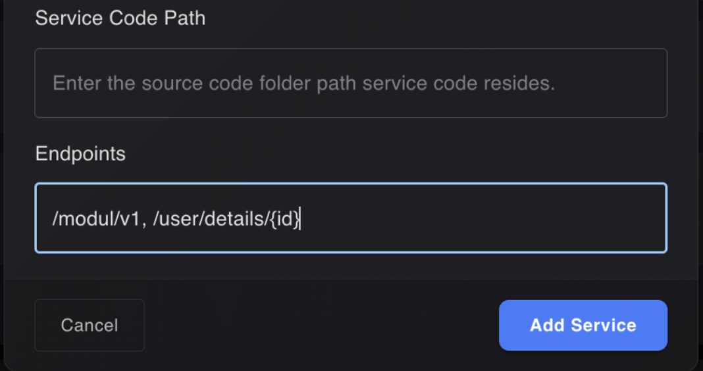

For monolithic repositories, users can create BaseRock services that logically represent a specific section of the monolith. Each service corresponds to one or more application modules into which the monolith has been structured, and should be named accordingly.

To discover endpoints associated with these modules, users can choose one of two approaches:

Provide a Service Code Path pointing to the relevant module(s), or

Specify routers or controllers in the Endpoints text area, where they can list either individual endpoints or entire routers/controllers.

In the above screenshot “/module/v1” will discover all the endpoints that belong inside this controller/router and it will also discover the exact endpoint named as “/user/details/{id}”

### Service Requirement Document

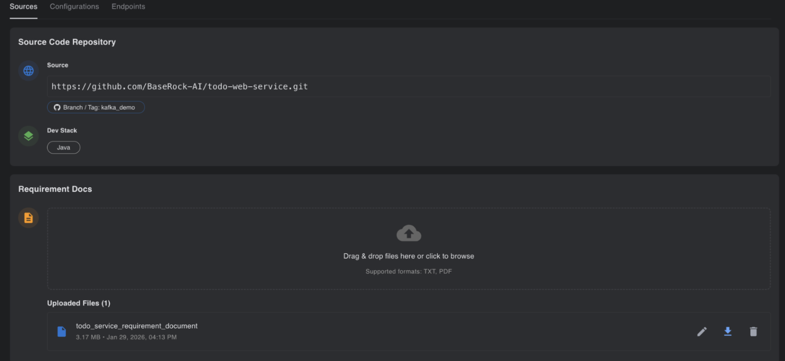

Service requirement document is a document used by BaseRock to gather more context about the service under test.

This document content does not need to follow any specific formatting. Document type should be .txt and .pdf with total size of 10MB max.

Ideally expectations from a document is to have API details, API rules, examples as well as some validation checkpoints and user flows. But all the abovementioned are not mandatory and the document can have very basic information written in plain english as well.

A sample data in the document might look like this:

**Example:**

```
Purpose
This document outlines the requirements for a web-based To-Do List Application that enables users to efficiently manage and organize their daily tasks from any browser.
Features
- Users can register using an email and password via /auth/register endpoint.
- The task title must be between 5 and 250 characters when using POST/create-task.
- Users can set due dates and times for tasks.
- Users can assign priority levels (e.g., Low, Medium, High).
- Users can filter tasks by category, due date, completion status, or priority.
Use Cases
-Data is tied to individual user accounts and securely retrieved upon login.
-Upon creation of a new TODO list item, a corresponding JIRA ticket must be automatically created.
- An email notification must be sent to the task creator upon successful JIRA ticket creation for a new TODO item.
- The email notification must include a direct link to the newly created JIRA ticket.
- All requests for new TODO list items and their corresponding email notifications must be audited for tracking and compliance purposes.
```

### Test Creation

The test cases depend on:

Source code read from repository

Requirement document uploaded by user (optional)

Prompt given by user (optional)

Test cases can be generated from 2 places - Within the business flow or Within the service

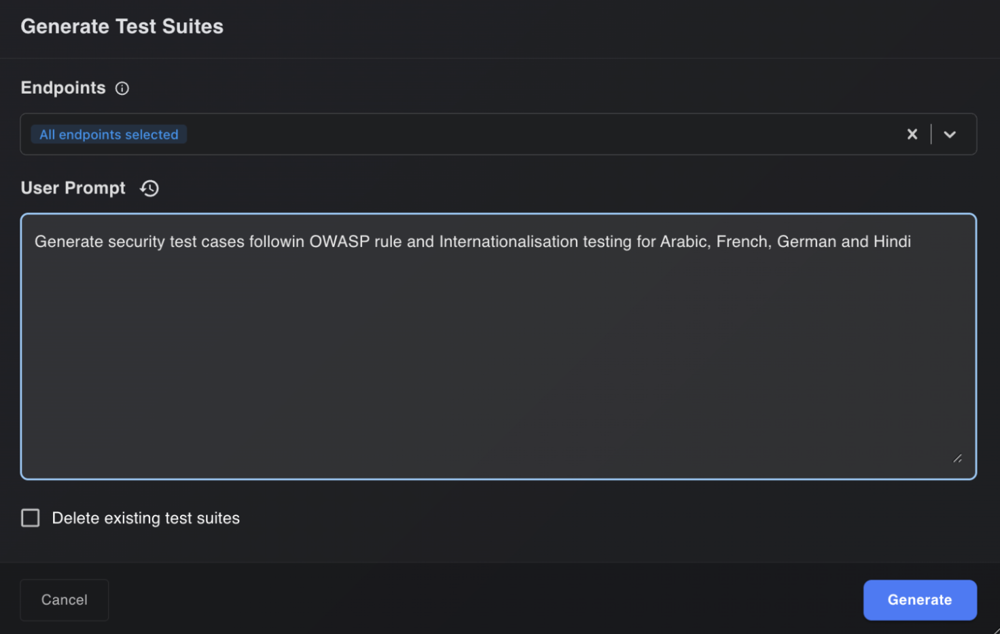

When inside the business flow section and “use case” tab, after generating the use cases, users can click on 3 dots on top right and select “Map Use Cases To Test Cases” and BaseRock would generate test cases as well as map it to respective use cases. (We will see more about Use Cases in the upcoming section)

When inside the individual service user can click on 3 dots on the top right corner and click “Generate Test Suite” a window will be shown as above where the user can either provide a prompt for adding domain specific instructions or simply click on generate to generate an optimized number of test cases based on source code.

Final results would look like something as shown below

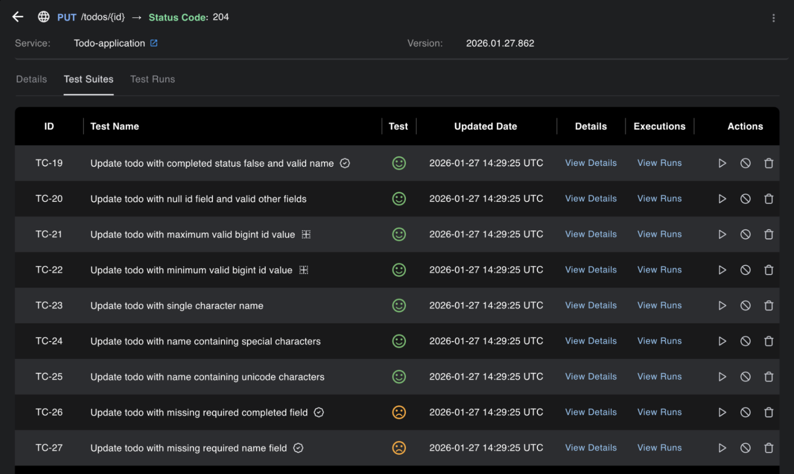

### Running Tests

Tests can be executed in 2 different ways:

A single test case to perform dry runs quickly for ensuring users are going in the right direction. This is done via UI by clicking on a triangular shaped run button.

> **NOTE: In order to run via UI user has to ensure that the BaseRock agent is actively running on the machine where they want the execution to take place.**

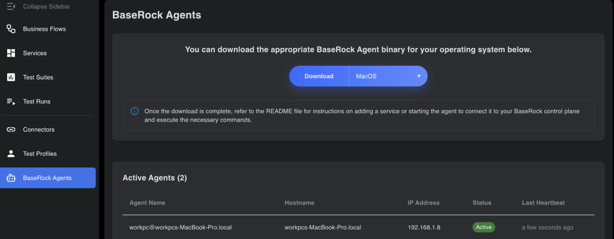

Multi test runs like a smoke or regression or all tests of a single service - This can be achieved by configuring the run_tests.sh file according to the need and running it via CLI or CICD pipeline. Examples as shown in the section - Execute test suite

## Playbooks

Playbooks are essentially a configuration window where users can instruct BaseRock in simple plain English that gets converted into actionable steps.

This can be used in the following ways:

Set preconditions and postconditions for testing an endpoint. Ex: authentication before triggering an API and deletion of test data after test execution.

Perform special actions like capturing system date/time, generating a random string/number and storing in a variable to use later, loop a test at a specific interval, ask BaseRock to use an already existing value in a payload during runtime, etc.

Playbooks is the most powerful feature of BaseRock when used properly and it enables users to be as creative as they want.

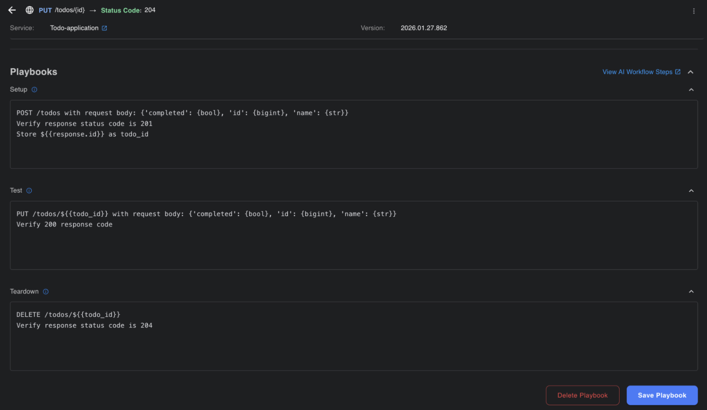

In the above example screenshot:

The goal is to test the PUT /todos/${{todo_id}} endpoint. However, to automate this test, a todo item must always exist so that the PUT endpoint has a resource to update.

In automated testing, it is standard practice to execute the full flow from the beginning, even when the objective is to validate an intermediate step (in this case, the PUT endpoint).

Therefore, we use the Playbooks (Setup) section to create a todo item at the start of every test run. This ensures that a valid todo item is always available for the update operation. During this setup step, the system-generated todo_id is captured at runtime and stored for reuse in the subsequent PUT request.

After the PUT operation is tested, a postcondition step executes a DELETE request to remove the created todo item. This cleanup step prevents test data from accumulating in the database across multiple test executions.

#### Playbooks Hierarchy:

Playbooks are a medium to communicate with BaseRock AI via english prompts. These playbook text areas are available on various stages and for different uses. Let’s understand the hierarchy of playbooks and how to use them.

Precedence level (high to low):

Test Case Level Playbook > Endpoint Level Playbook > Service Level Playbook

Coverage level (high to low):

Service Level Playbook > Endpoint Level Playbook > Test Case Level Playbook

Service Level Playbook

Service level playbooks have the highest coverage i.e it works for the entire service. Any data or instruction that needs to be used again and again in multiple end points or test cases can be defined here which then automatically cascades, hence reducing the repeatability aspect.

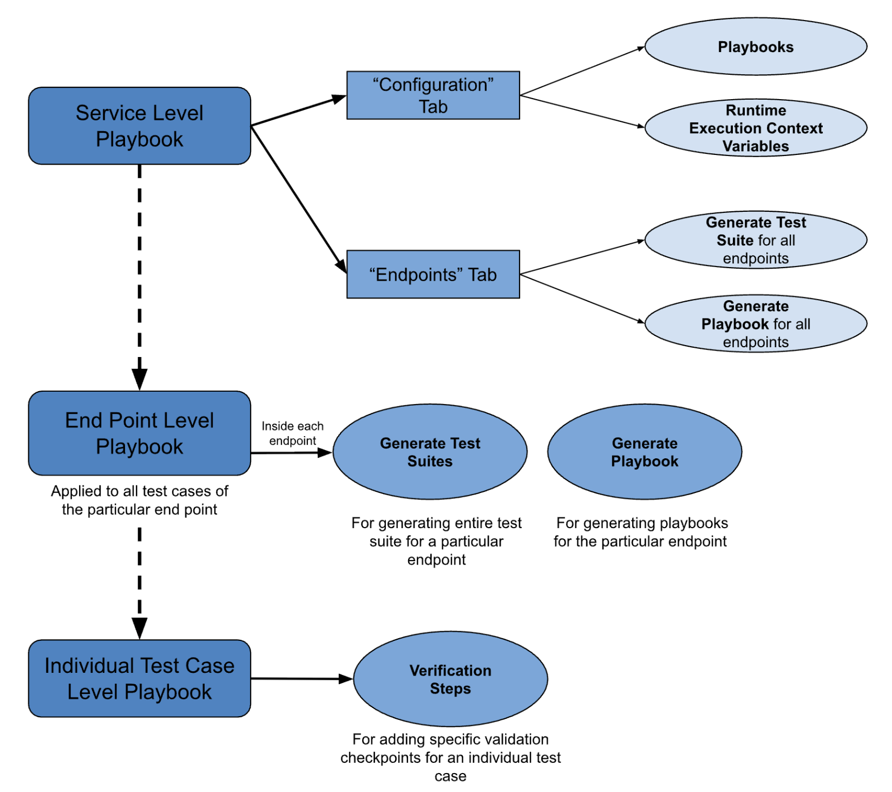

These playbooks take precedence over service level and if there are any instructions that need to override the service level but are required for all the test cases of that end point then it can be populated here.

For example:

In the service playbook, let’s say you define a variable in the “Runtime Execution Context Variables” section as: user_name: johndoe123

The service-level playbook can then refer to it as ${user_name} for some instruction.

However, if there is an endpoint /login that specifies:

POST /login with user_name: "johnwick321"

then the endpoint-level value (johnwick321) will override the service-level variable.

Additionally, if the username (or any variable) is dynamically generated (ex: random email address) at runtime within the endpoint definition, that generated value will also take precedence over the service-level variable.

Test Case Level Playbook

When there are some specific test case level validations which might depend on the domain. Then those can be explicitly populated here by the product/domain expert.

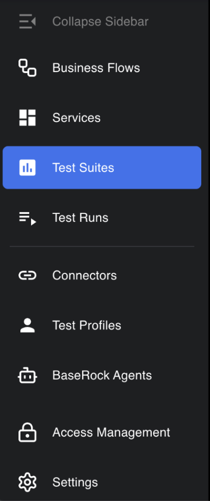

Detailed walkthrough of the BaseRock UI Portal.

### Side Bar Navigation Menu

The panel on the left can be used to navigate to

different sections of BaseRock portal that provides

access to all the functionalities.

#### Business Flows

This section allows user to generate use-cases out of the given PRD document and map the corresponding AI generated test scripts to create a Requirement Traceability Matrix

#### Services

Services section consists of the list of services that BaseRock has learnt from source code.

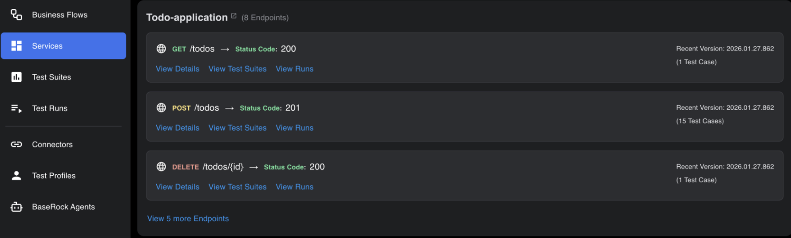

This is the page where you will be able to see all the services under test of your applications with an infinite scroll and corresponding versions in front.

In order to see more information about the services, you can either click on the name of the service or “View x more endpoints”.

Once you click on the name of the service, you will land on the following page shown below.

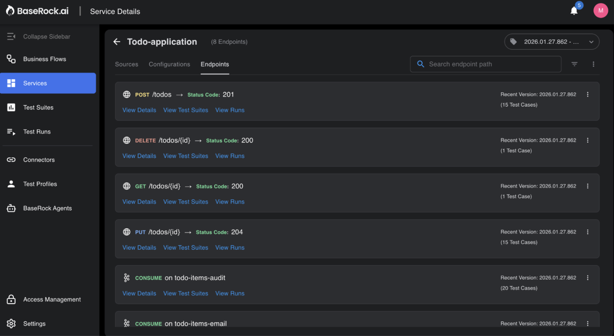

There are 3 tabs within a particular service - Sources, Configurations and Endpoints.

Sources :

It shows the way BaseRock has learnt about the service and the way you can feed more context to BaseRock via a requirement document.

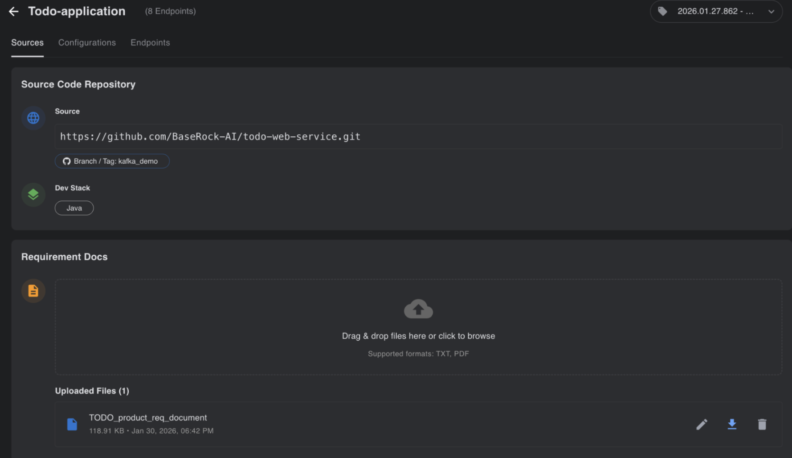

Another example of BaseRock’s learning via Github repository is shown above under the sources tab of the service.

**Versioning:**

Users can maintain different versions of branches of the service to make sure the test cases generated for previous versions stay intact and do not get updated without approval.

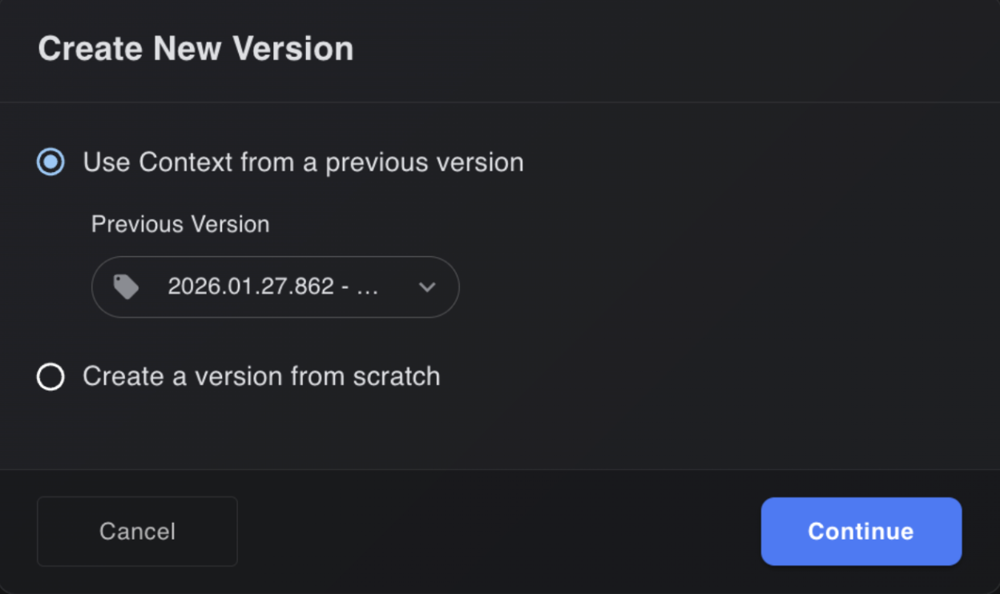

A versioning use case could be, The first time service is set up with a main branch and later a feature branch containing significant changes need to be tested but without making any changes in previous test cases generated for the main branch.

This highlights the need for version-aware testing to support parallel validation across code branches.

Configurations:

The next tab is Configurations where a user can define additional context variables and their values (static or dynamic via instructions) to be used for performing any computations or providing actions via playbook.

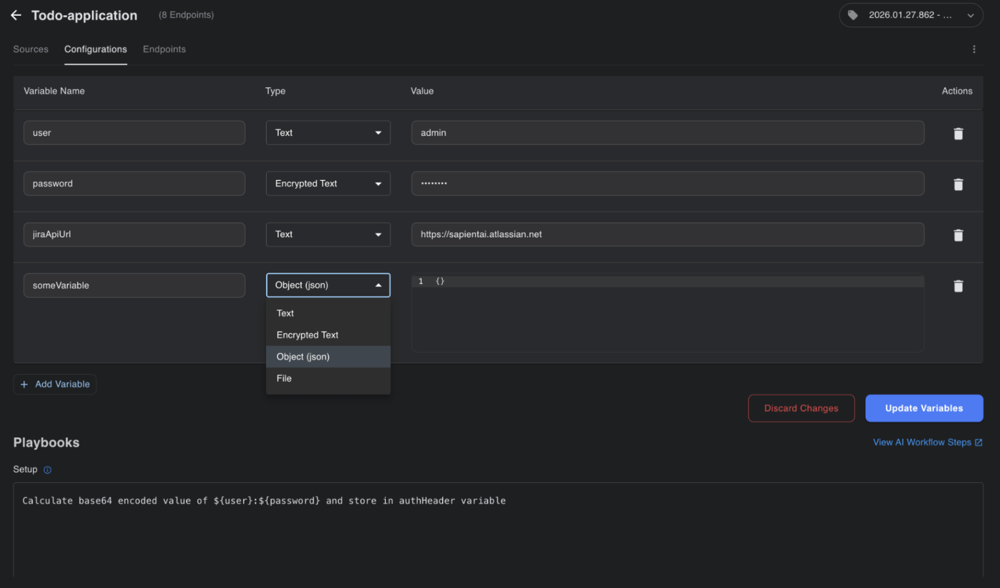

For example, you can create variables like for credentials for an authentication token that needs to be passed to the payload of the API request before sending it.

Open-Questions:

Open questions is BaseRock’s intelligence to bridge the context gap between what it has learnt from the source code and the information missing in order to run the end to end flows.

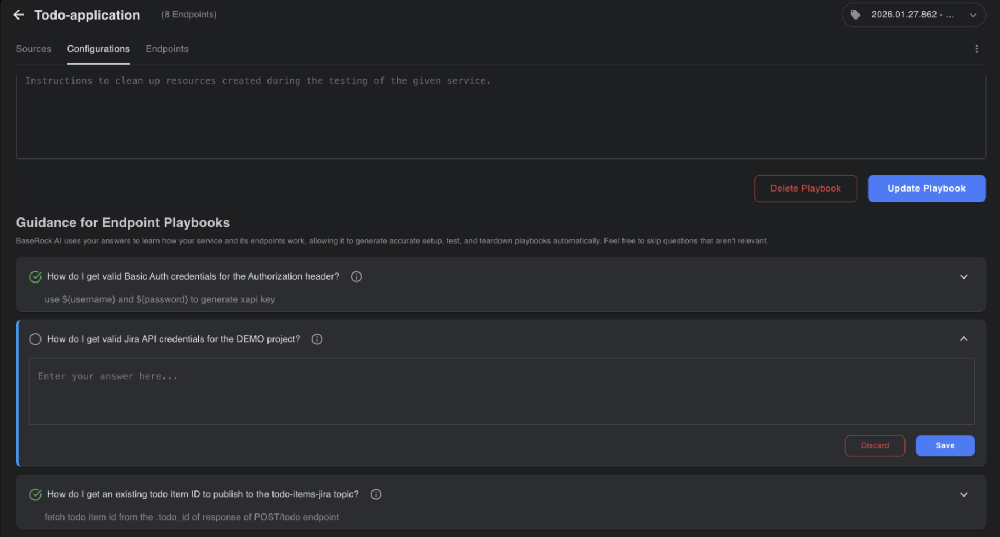

Open questions can be answered in a very simple and plain english to either provide answers or perform some actions and fetch the answers on runtime dynamically.

Endpoints:

Third tab within the service is Endpoints, where all APIs, Kafka topics, etc will be shown as per the learning of BaseRock, shown in the images.

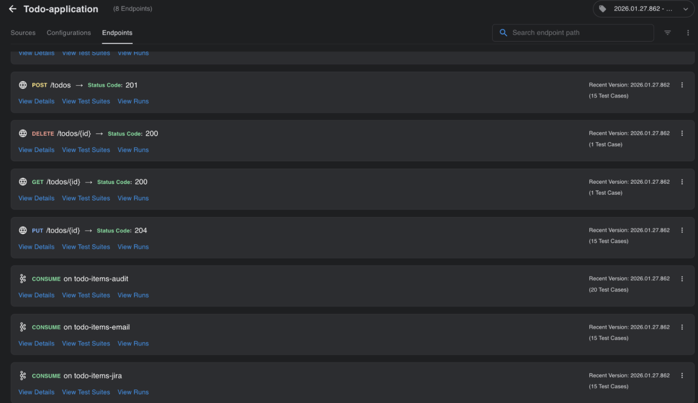

Now each of the respective end points will be having their details, a suite of test scripts covering positive, negative and edge cases and execution results of the respective suite.

The 3 dots on the top right corner inside the Endpoints tab will give users options to Generate Playbook, Generate test suite, rediscover API endpoints and modify service.

This is the main step towards test case generation

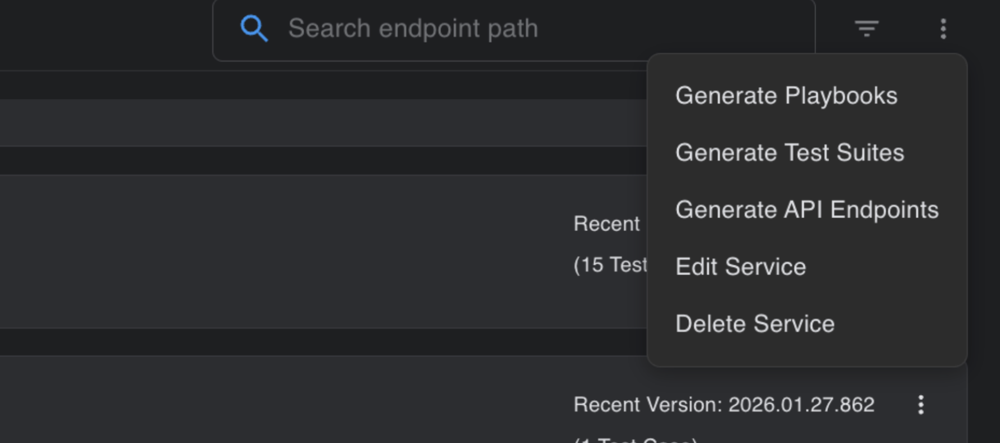

This allows users to add some more test cases according to their domain expertise and business specific requirements.

Further inside an endpoint you can verify the schema of the same endpoint using which different flavours of payload and test cases will be generated.

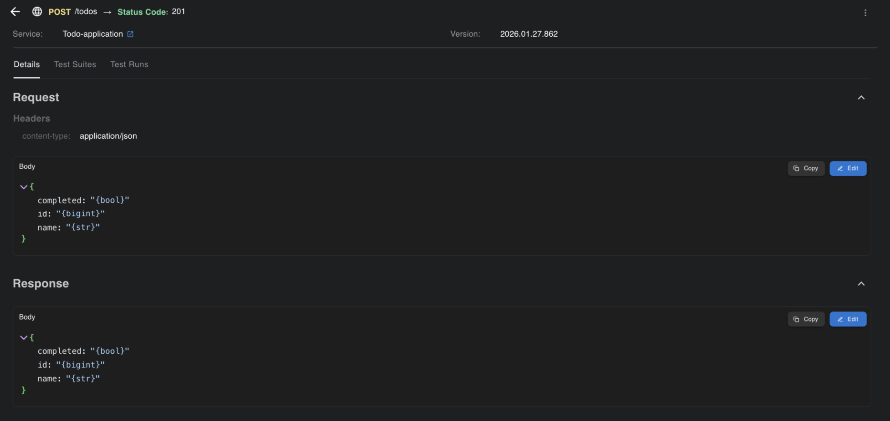

#### Test Suites:

This section is a consolidated section for all the test suites present in all the services learnt by BaseRock.

You can use filters to find the desired tests and customize the way you want the table to look like.

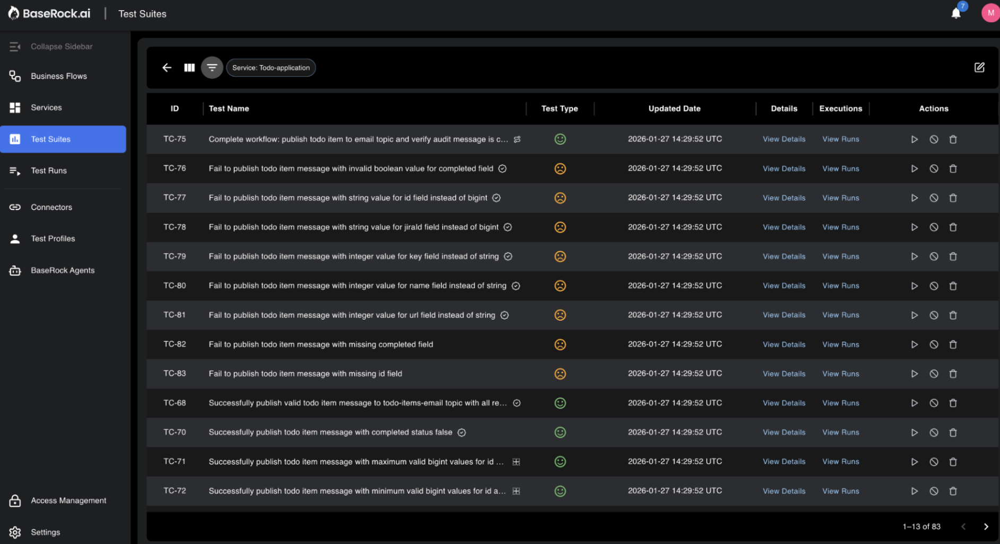

#### Test Runs:

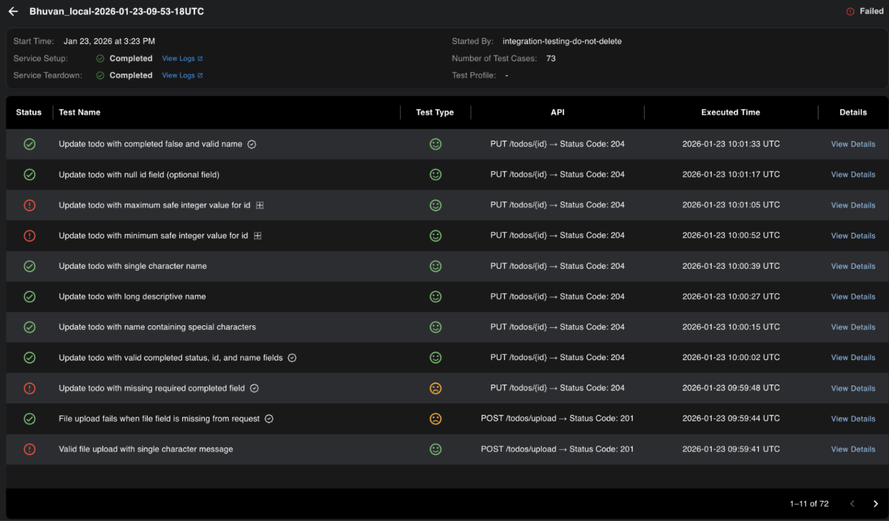

You can filter and see the results based on your choice according to the type of test or which service it belongs to, etc.

## BaseRock Agent Usage

As explained in the BaseRock Agent Introduction above, in a nutshell, BaseRock agent essentially allows BaseRock control-plane to communicate with the developer’s system or machine on which test execution takes place (physical or virtual).

There are 3 primary usages of BaseRock agent:

To execute single test cases via UI

To execute bunch of test suites either by manual trigger or CICD pipeline

Create service on BaseRock from locally available source code if not via git connector

BaseRock agent can be downloaded from the UI from the left panel. Once done make sure that the env is set (run set_env.sh) and the agent is whitelisted (run startup.sh)

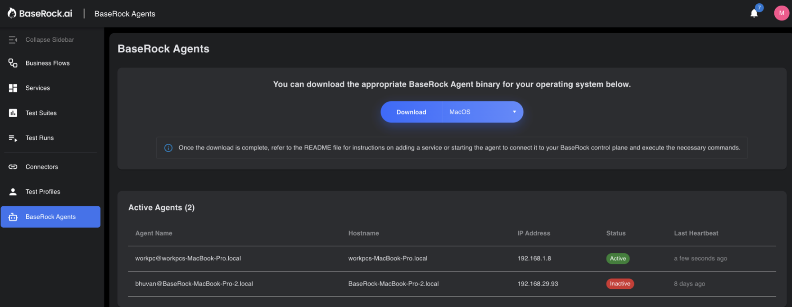

#### Execute single test case:

BaseRock allows users to run a single test case right from the UI. Every test case has a “run” button in front of it.

The only condition is that the BaseRock agent should be already running and be in Active status as shown above.

In order to activate agent, run the file start_baserock_daemon.sh being inside the baserock_agent folder that you’ve downloaded.

#### Execute test suite:

In order to run multiple tests, the user has to first configure the suite file (named as run_tests.sh) inside BaseRock agent folder and then execute it.

Configurations are as below:

```bash
./baserock_agent --run-tests \
--service="service_ABC" \
--env="staging123" \
--service-url="https://app.dev.yourCompany.com/" \
--protocol="rest,graphql,kafka" \
--test-case-id="TC-1,TC-2" \
--category="HAPPY_TEST_CASES or NEGATIVE_TEST_CASES" \
--endpoints="/user/auth,/temp/job,/user/jobs" \
--version="2025.12.11.978" \
--method="GET,POST,PUT,DELETE,PATCH"
```

Where,

Service is the name of the service inside baserock in which the test cases are present.

Env is just a string to organise the tests based on the environment it is running on like staging or preprod.

Service-url is the base url of the endpoints of your application

Protocol is the type of endpoint like REST or Kafka or graphQL

Test case id is used when user want to club any specific test case under this suite

Category is the type of test case that BaseRock has generated

Endpoints are essentially when you want to organise the suite based on the endpoint level

**Version is your service version**

Methods are your API methods

For multiple set of values, use double quotes and comma separated as shown in example

#### Add service via git:

This option allows users to add a specific version of a service on BaseRock directly from the local machine without first pushing to the cloud repo.

Run the file add_service.sh after configuring the following inside this file.

```bash
./baserock_agent --add-service \
--service=<service-name> \
--tech-stack=<tech-stack> \
--integration-type=<Integration-type> \
--local-src-path=<local-src-path>
```

Here,

Service is the name of the service you want to store it as and it will reflect on BaseRock UI

Tech stack is your micro-service programming language. User can just mention Java, Python, GoLang, Javascript, etc

Integration is not mandatory, It is like the additional information of the tech stack for example, Springboot for Java, Django for Python, kafka, etc

Local src path is basically the path where you have the source code saved in the local system from which BaseRock will learn and discover the endpoints. This will be later reflected in BaseRock UI once discovery is completed

Common CLI commands for using BaseRock agent as a CLI tool:

Authenticate against BaseRock Control Plane

```bash
./baserock_agent --login --email=<email>
```

Run Test Suite (Explained above)

```bash
./baserock_agent --run-tests \
--service="service_ABC" \
--env="staging123" \
--service-url="https://app.abcd.com/" \
--protocol="rest,graphql,kafka" \
--test-case-id="TC-1,TC-2" \
--category="HAPPY_TEST_CASE or NEGATIVE_TEST_CASE" \
--endpoints="/user/auth,/temp/job,/user/jobs" \
--version="2025.12.11.978" \
--method="GET,POST,PUT,DELETE,PATCH"
```

Add Service from local source path instead of using UI

```bash
./baserock_agent --add-service \
--service=<service-name> \
--tech-stack=<tech-stack> \
--integration-type=<Integration-type>
```

Detailed Examples:

Run All test cases of “petstore-backend” service against a QA environment, where the service is hosted at https://qa.example.app/petstore-backend.

**Prerequisites:**

User has access to the BaseRock control plane (By default it’s https://app.baserock.ai)

The user has already onboarded a service named as “petstore-backend” resulting in discovery of many endpoints.

The user has generated and reviewed playbooks for the endpoints that entail setup, test and teardown steps.

The user has already generated and reviewed test suites for some of the endpoints.

The user has an instance of the petstore-backend service already running successfully at https://qa.example.app/petstore-backend URL.

**Command Line:**

```bash
./baserock_agent --run-tests \
--service=petstore-backend \
--env=QA \
--service-url=https://qa.example.app/petstore-backend
```

Run All positive test cases of “petstore-backend” service against a Localhost environment, where the service is hosted at http://localhost:8080

**Prerequisites:**

User has access to the BaseRock control plane (By default it’s https://app.baserock.ai)

The user has already onboarded a service named as “petstore-backend” resulting in discovery of many endpoints.

The user has generated and reviewed playbooks for the endpoints that entail setup, test and teardown steps.

The user has already generated and reviewed test suites for some of the endpoints.

The user has an instance of the petstore-backend service already running successfully at https://qa.example.app/petstore-backend URL.

**Command Line:**

```bash
./baserock_agent --run-tests \
--service=petstore-backend \
--env=QA \
--service-url=http://localhost:8080 \
--category=HAPPY_TEST_CASE
```

> **Note: category is specified as an additional filter.**

Run test cases of specific set of endpoints - /inventory and /owners “ petstore-backend” service against a Localhost environment, where the service is hosted at http://localhost:8080

**Prerequisites:**

User has access to the BaseRock control plane (By default it’s https://app.baserock.ai)

The user has already onboarded a service named as “petstore-backend” resulting in discovery of many endpoints.

The user has generated and reviewed playbooks for the endpoints that entail setup, test and teardown steps.

The user has already generated and reviewed test suites for /inventory and /owners endpoints.

The user has an instance of the petstore-backend service already running locally at http://localhost:8080 URL.

**Command Line:**

```bash
./baserock_agent --run-tests \
--service=petstore-backend \
--env=QA \
--service-url=http://localhost:8080 \
--endpoint=/inventory,/owner
```

> **Note: endpoint addresses are specified as an additional filter with comma delimiter.**

Run test cases of specific method (“POST”) of a specific endpoint (“/inventory”) for “petstore-backend” service against a Localhost environment, where the service is hosted at http://localhost:8080

**Prerequisites:**

User has access to the BaseRock control plane (By default it’s https://app.baserock.ai)

The user has already onboarded a service named as “petstore-backend” resulting in discovery of many endpoints.

The user has generated and reviewed playbooks for the endpoints that entail setup, test and teardown steps.

The user has already generated and reviewed test suites for POST /inventory endpoint.

The user has an instance of the petstore-backend service already running locally at http://localhost:8080 URL.

**Command Line:**

```bash
./baserock_agent --run-tests \
--service=petstore-backend \
--env=QA \
--service-url=http://localhost:8080 \
--endpoint=/inventory \
--method=POST
```

> **Note: endpoint addresses and method are specified as additional filters.**

Run a very specific test case (Pet name must be of alphabetical characters) of specific method (“POST”) of a specific endpoint (“/inventory”) for “petstore-backend” service against a Localhost environment, where the service is hosted at http://localhost:8080

**Prerequisites:**

User has access to the BaseRock control plane (By default it’s https://app.baserock.ai)

The user has already onboarded a service named as “petstore-backend” resulting in discovery of many endpoints.

The user has generated and reviewed playbooks for the endpoints that entail setup, test and teardown steps.

The user has already generated and reviewed the specific test suite for POST /inventory endpoint that deals with the description as “Pet name must be of alphabetical characters”. By going into the test case details, one is able to capture the test case uuid (See 693964ce490c4e57327b54c5 in the screenshot below for the reference).

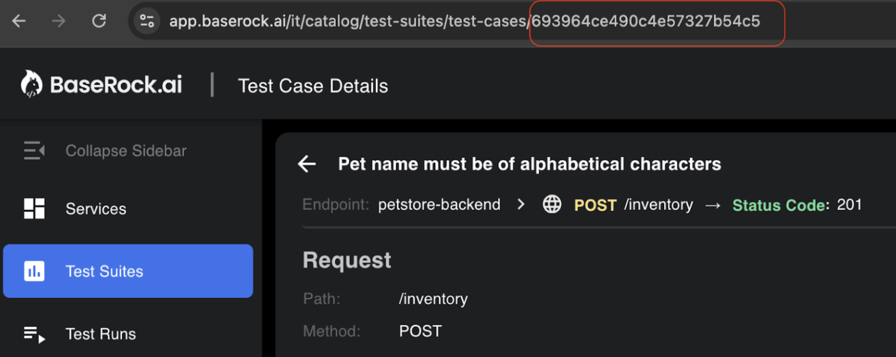

The user has an instance of the petstore-backend service already running locally at http://localhost:8080 URL.

**Command Line:**

```bash
./baserock_agent --run-tests \
--service=petstore-backend \
--env=QA \
--service-url=http://localhost:8080 \
--test-case-uuid=693964ce490c4e57327b54c5
--test-case-id=SVC-1, SVC-2
```

> **Note: test-case-uuid are specified as additional filters with comma delimiter for multiple test case uuids.**

## Appendix

Try hands-on with sample TODO List application:

https://github.com/BaseRock-AI/todo-web-service-public for backend

https://github.com/BaseRock-AI/todo-web-app frontend
